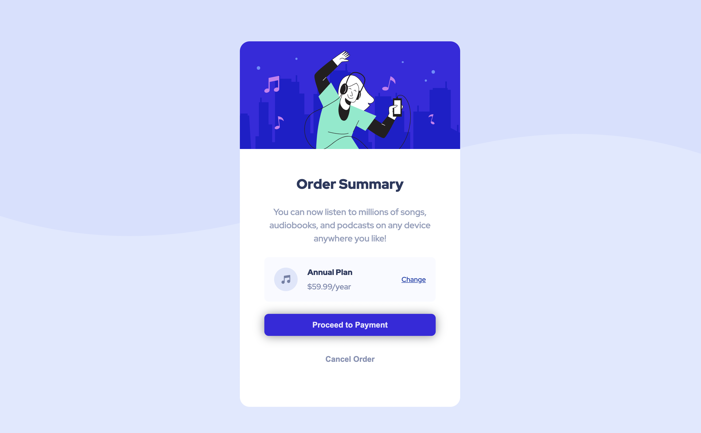

# Frontend Mentor - Order Summary Component

---

## Table of Content

* [Useful Links](#useful-links)
* [Mobile version](#mobile)
* [Desktop version](#desktop)
* [Active state](#active)

---

### Useful Links 

* [FM - Order Summary Component](https://www.frontendmentor.io/challenges/order-summary-component-QlPmajDUj)

* [Vercel: My Solution](https://fm-03-order-summary-tau.vercel.app/)

--- 
### Mobile version 

--- 
### Desktop version 

---
### Desktop version 

